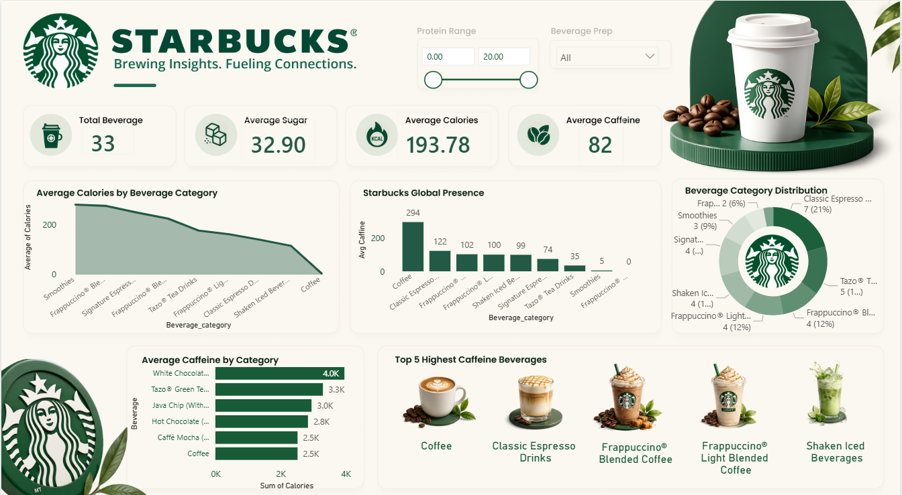

# ☕ Starbucks Power BI Dashboard

## 📌 Project Overview
This Power BI dashboard analyzes Starbucks beverages using interactive visualizations and KPIs. It helps users explore calories, sugar, caffeine, beverage categories, and preparation methods.

## 📊 Dashboard Features
- Total Beverages
- Average Calories
- Average Sugar
- Average Caffeine
- Beverage Category Distribution
- Top 5 Highest Caffeine Beverages
- Average Calories by Beverage Category
- Starbucks Global Presence
- Interactive Slicers (Protein Range & Beverage Prep)

## 🛠 Tools Used
- Power BI
- Power Query
- DAX
- CSV Dataset

## 📂 Dataset
- starbucks.csv
- directory.csv

## 📸 Dashboard Preview

## 📁 Files Included

- `starbucks-analysis.pbix`
- `starbucks.csv`
- `directory.csv`
- `README.md`
